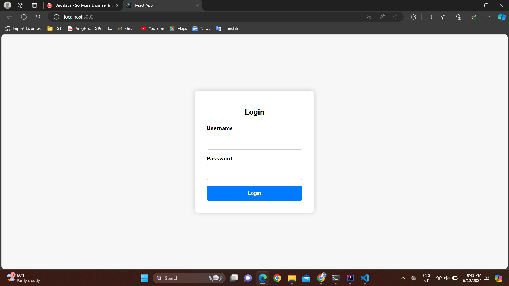
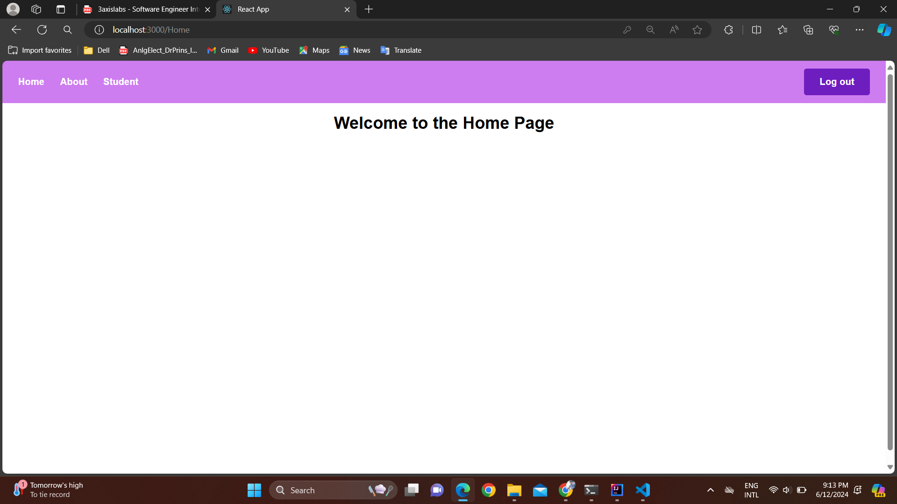
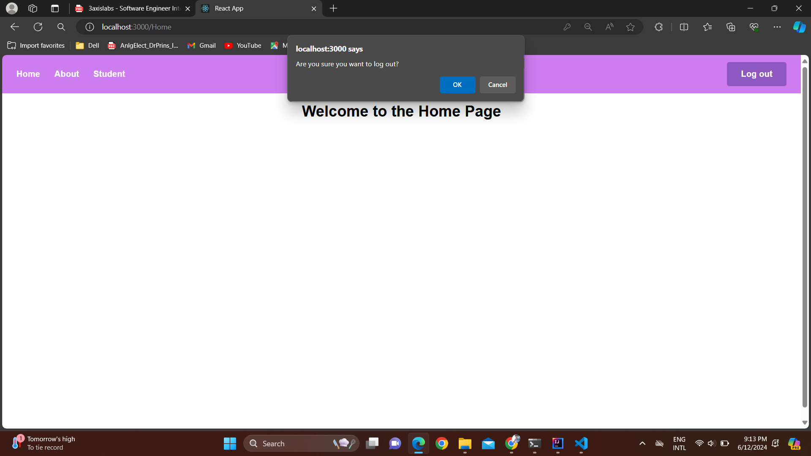

# Imaginary school system for managing student attendance.

The Imaginary School System is a web application designed to manage student attendance efficiently. It features secure JWT authentication for user login and logout functionality. Upon login, users are directed to a dashboard where they can track and record student attendance for classes. Role-based access control ensures appropriate permissions for teachers, administrators, and staff. The system provides reporting capabilities to analyze attendance trends and support decision-making for student success.

## Setup and Installation

1. Clone the repository: https://github.com/dilen1999/Imaginary-School-System

### Frontend (React)

#### Prerequisites
- Node.js installed

2. Navigate to the client directory:

3. Install dependencie using : npm i

### Backend (Spring Boot)

#### Prerequisites
- Java JDK installed
- Maven installed (for building the project)

2. Navigate to the server directory:

3. Install dependencies (if using Maven):

## Running the Application

### Frontend (React)

1. Start the development server: npm start

   
The React frontend should now be running on `http://localhost:3000`.

### Backend (Spring Boot)

1. Run the Spring Boot application:
   
The Spring Boot backend should now be running on `http://localhost:8080`.

## Screenshots

User name : username
Password : password

